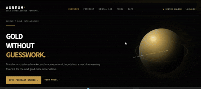

# AUREUM — Gold Intelligence Terminal

A Streamlit-based gold price forecasting app that lets you manually enter market and macroeconomic inputs and generate a gold-price estimate using a trained local linear-regression model.

## Overview

This project is designed for manual, controlled forecasting rather than live market data ingestion. It uses a saved model and scaler from the project folder and asks the user to provide the inputs required by the model contract.

The app is built in Python and runs as a Streamlit dashboard.
---





---
## Features

- Manual market snapshot input form
- Gold price forecast based on a trained linear regression model
- MinMax normalization using saved preprocessing artifact
- Feature grouping for price, trend, macro, and market inputs
- Forecast export as CSV
- Session history for recent predictions
- No live market data feed or external API dependency

## Project files

- `app.py` — Streamlit application
- `linear_regression_model.pkl` — trained regression model
- `minmax_scaler.pkl` — saved feature scaler
- `requirements.txt` — Python dependencies

## Requirements

- Python 3.10+
- pip

## Setup

1. Open a terminal in the project folder.
2. Create and activate a virtual environment:

```bash
python -m venv .venv
```

On Windows PowerShell:

```powershell
.\.venv\Scripts\Activate.ps1
```

On macOS/Linux:

```bash
source .venv/bin/activate
```

3. Install dependencies:

```bash
pip install -r requirements.txt
```

## Run the app

```bash
streamlit run app.py
```

Then open the local URL shown in the terminal, typically:

```text
http://localhost:8501
```

## How it works

The app loads:

- a trained model from `linear_regression_model.pkl`
- a `MinMaxScaler` from `minmax_scaler.pkl`

It then expects the user to provide the model’s required 22 feature values, including:

- recent gold prices
- moving averages
- macro indicators
- market conditions
- calendar values for year, month, and day

The app prepares the input DataFrame, applies the stored scaler, adds calendar features, and passes the result to the model to generate a forecast.

## Important note

This app is intentionally built for manual input and does not download live market data automatically. The model expects values on the same scale and unit conventions used in training.

## Example usage

1. Open the app in the browser.
2. Fill in the market and macro inputs.
3. Choose the observation date.
4. Click the forecast button.
5. Review the predicted gold price and export the result if needed.

## License

This project does not include a specific license file. If you plan to share or distribute it publicly, add a license before doing so.
